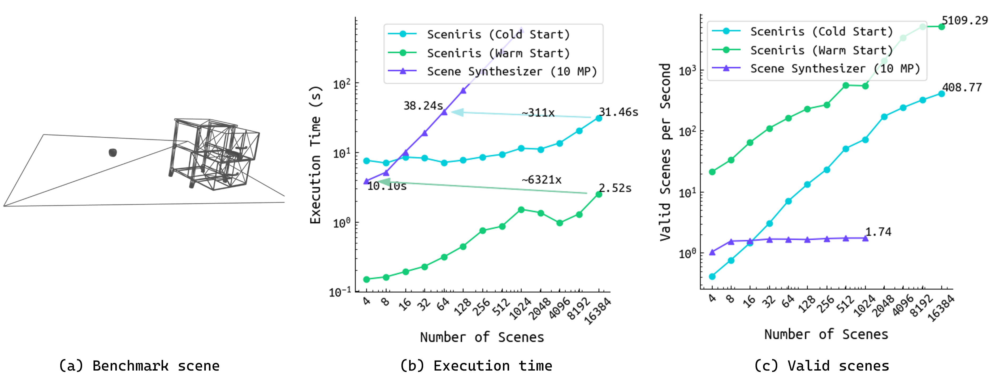

## Sceniris: a fast procedural scene generation framework
Sceniris is a procedural scene generation framework that generates a massive amount of environment instances in a short time. [How fast?](#how-fast-is-sceniris). The framework is developed on top of [scene_syntheizer](https://github.com/NVlabs/scene_synthesizer) and [curobo](https://curobo.org/). Sceniris also supports more spatial relationships. The speedup mainly comes from three aspects: batched sampling, batched pose computation, and curobo's parallel collision checking.


### Installation

1. Install [curobo](https://curobo.org/get_started/1_install_instructions.html)
2. Install sceniris `pip install git+https://github.com/bdaiinstitute/sceniris`

### Usage
- From config
```
from sceniris.scene import Scene
# give a config
cfg = {
    "env": {
        "num_envs": args.num_envs,
        "env_size": args.env_size,
    },
    "objects": [
        {
            "id": "orange",
            "asset_path": os.path.expanduser("~/fm_storage/fm_assets/ycb_fixed_v2/017_orange/textured/textured.usd"),
            "constraints": [
                {
                    "anchor_object_ids": ["drawer", "mug"],
                    "direction": "middle",
                }
            ]
        },
        {
            "id": "drawer",
            "asset_path": os.path.expanduser("~/fm_storage/fm_assets/usd/unit_1/unit_1.usd"),
            "joint_states": [
                {
                    "joint_ids": ["drawer_joint_lower"],
                    "max": 0.3,
                    "min": 0.1,
                    "distribution": "uniform",
                },
                {
                    "joint_ids": ["drawer_joint_upper"],
                    "max": 1.0,
                    "min": 0.7,
                    "distribution": "uniform",
                },
            ]
        },
        {
            "id": "banana",
            "asset_path": os.path.expanduser("~/fm_storage/fm_assets/ycb_fixed_v2/011_banana/textured/textured.usd"),
            "parent_id": "drawer/unit_1_upper_drawer", # might need to optimize the part name in trimesh scene
            "relation_to_parent": "top",
        },
        {
            "id": "mug",
            "asset_path": os.path.expanduser("~/fm_storage/fm_assets/ycb_fixed_v2/025_mug/textured/textured.usd"),
            "constraints": [
                {
                    "anchor_object_ids": ["drawer"],
                    "direction": "front",
                    "distance": 0.5,
                    "distance_type": "greater",
                    "relation_axis_transform": "drawer",
                }
            ]
        },
    ]
}
scene = Scene.gen_from_cfg(cfg) # initialize a scene
scene.gen() # generate!!!
```

- By step-by-step coding
[Example code](src/sceniris/scripts/tries/try_mid_scene.py)


### How fast is Sceniris
For a similar env config:

Sceniris: 16384 env instances (13000+ valid) in just 30 seconds

Scene_synthesizer (with 10 multiprocessing): 64 env instances in 36 seconds
